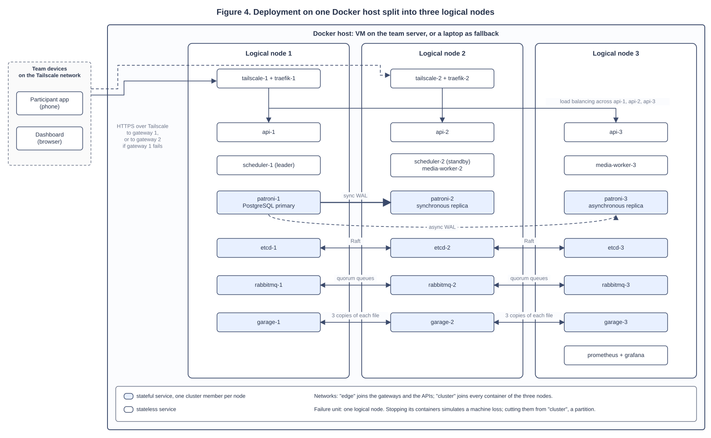
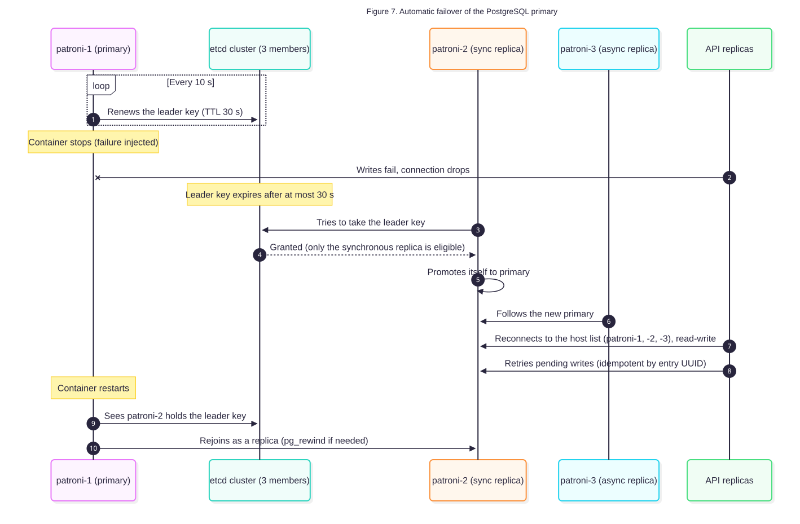
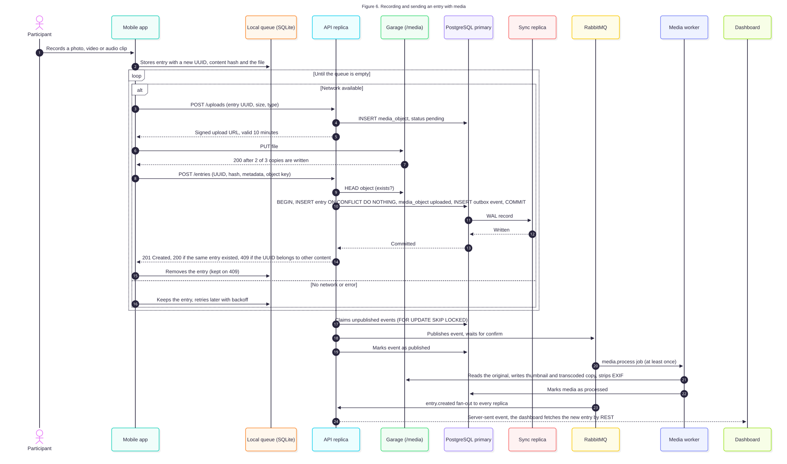

# Architecture

Status: proposed, 29 September 2026. Nothing described here is implemented yet. The
architecture and the technology stack still need validation by the Project and Distributed
Systems professors.

## Why the system is distributed

An entry recorded in the moment cannot be collected again later. If the platform loses it, the
data point is gone, and in a two-week diary study a lost day can invalidate a participant. The
design follows from that and from four other facts:

- When an activity goes out to every participant at the same time, the answers arrive in a
  burst, many of them carrying photos, audio or video of several MB.
- A study runs for days or weeks without a maintenance window.
- The platform runs several studies at once, and researchers follow them in real time.
- Participants are out in the street with intermittent connectivity, so the phone has to keep
  entries and resend them, and the server has to accept resends without creating duplicates.

## Deployment

*Figure 3. Component architecture and data flows. Each box is a service type; the number of instances is in its label.*

*Figure 4. Deployment on one Docker host split into three logical nodes. Blue boxes are stateful cluster members; horizontal lines are replication between nodes.*

The whole stack runs on one Docker host with Docker Compose. The host is a virtual machine on
the team's home server. The same Compose project runs on a laptop with Docker Desktop, which is
the fallback if the server or its connection fails on a presentation day. Cluster members find
each other by Compose service name, never by IP address, so the clusters survive container
recreation and a move to another host. Moving to the laptop means starting from a fresh
bootstrap with generated demonstration data, not copying the server's volumes.

Inside that host the services are grouped into three logical nodes. Each logical node has its own
containers, its own volumes and its own member of every cluster, so stopping every container of
one node simulates the loss of a machine. The failure unit in the fault model is the logical
node. The physical host, its Docker daemon and its disk are a declared single point of failure
(see [fault model](fault-model.md)).

The Compose project groups each node's services under a Compose profile, so each logical node can
later move to its own machine without redesign.

Access goes through Tailscale, a private network built on WireGuard: only devices signed in to
the project's Tailscale network (the team's phones and computers) can reach the platform, and no
port is opened to the Internet. This fits a proof of concept used only by the team. A real deployment
with participants from the public would replace the two Tailscale addresses with one public hostname
on a domain owned by the project, served by a Cloudflare Tunnel with a connector on each gateway, and
keep Tailscale only for administration; everything behind the gateways stays the same. The reasoning
and the alternatives are in `06_Dados_Investigacao/07-network-access-options.md`.

### Networks

| Network | Members | Purpose |
|---|---|---|
| `edge` | The two gateways (Tailscale and Traefik), API replicas, Garage S3 endpoints | Traffic from the clients |
| `cluster` | Every API, scheduler, worker and cluster member of the three nodes | Traffic between nodes: database, etcd, RabbitMQ, Garage replication |

A network partition is simulated by disconnecting every container of one node from `cluster`.
The isolated node can no longer reach the other two, its API replica fails its health check and
Traefik stops sending it requests. On one host only a split of one node against two can be
tested; packet loss and latency are not simulated.

## Components

| Component | Technology | Instances | Role |
|---|---|---|---|
| Participant app | React Native with Expo, TypeScript | One per phone | Receives activities, records entries, keeps an offline queue in SQLite |
| Researcher and admin dashboard | React with Vite, TypeScript | Served by the API replicas | Studies, activities, participants, entries, export, administration |
| Access | Tailscale | 2 containers, one beside each Traefik, on nodes 1 and 2 | Encrypted access for the team's devices without opening ports to the Internet, and an HTTPS certificate for each gateway address. Clients know both addresses and switch to the second when the first fails |
| Gateway | Traefik | 2, on nodes 1 and 2 | Routes `/api` to the API replicas and `/media` to object storage, load balancing, health checks, rate limiting |
| API | Python 3.12, FastAPI | 3, one per node | REST API, signed upload URLs, server-sent events to dashboards, outbox relay |
| Scheduler | Python | 2, on nodes 1 and 2, one active | Plans activity prompts with a constraint solver (see [scheduler](scheduler.md)) and sends push notifications |
| Media worker | Python with ffmpeg | 2, on nodes 2 and 3 | Thumbnails, conversion of videos to one common format, removal of metadata (including GPS) from photos, videos and audio. ffmpeg is an open-source command-line tool that reads and converts audio and video files; phones record video in different formats and sizes, and converting them to H.264 MP4 at a smaller resolution makes every video play in the dashboard and take less storage |
| Database | PostgreSQL 17 with Patroni and etcd | 3 of each, one per node | Relational data, automatic failover |
| Message broker | RabbitMQ with quorum queues | 3, one per node | Jobs for the media worker, events for dashboards |
| Object storage | Garage (S3 compatible) | 3, one per node | Photos, audio and video, 3 copies of every file. Each logical node is its own zone in the Garage layout, so the 3 copies land on 3 logical nodes. The 3 zones share one physical host, so Garage does not protect against losing the host, a declared single point of failure |
| Monitoring | Prometheus and Grafana | 1 each, on node 3 | Metrics and alerts during the failure demonstration. Not replicated |
| Push notifications | Expo Push (FCM underneath) | External service | Delivers activity notifications to phones |

## Language

The participant app's interface texts and the consent text will be available in Portuguese, because the participants are mostly in Portugal (see `00-research-context-unidcom.md` in the research files). English is the second language. The language of each participant is stored in `participant.locale`, with the values `pt` and `en` (see [data model](data-model.md)).

## How each layer tolerates failure

| Layer | Replication | Failure detection | Recovery |
|---|---|---|---|
| Client | Every phone is independent | The app sees a network error or a timeout | The entry stays in the local queue and is resent with the same UUID |
| Entry | 2 gateways, each with Tailscale and Traefik | The client's request to gateway 1 fails or times out | The client repeats the request on gateway 2 |
| API | 3 stateless replicas | Traefik calls `/health` every 2 s with a 1 s timeout. `/health` fails if the replica cannot write to the database or reach the broker | Traefik stops routing to the failed replica. Docker restarts a crashed container |
| Scheduler | 2 replicas, one leader | The leader renews a lease row in the database every 5 s. A lease not renewed for 15 s has expired | The standby takes the expired lease and continues from the plan stored in the database |
| Database | 1 primary, 1 synchronous replica, 1 asynchronous replica | The primary stops renewing its leader key in etcd (TTL 30 s) | Patroni promotes the synchronous replica. The old primary rejoins as a replica |
| Broker | 3 nodes, quorum queues | The RabbitMQ cluster loses a member | Queues keep working with 2 of 3 members. Unacknowledged messages are delivered again |
| Object storage | 3 copies, writes confirmed after 2 | Garage nodes stop seeing the member | Reads and writes continue with 2 nodes. The returning node catches up |

*Figure 7. Automatic failover of the PostgreSQL primary.*

## Consistency decisions

### Client-generated identifiers

Every entry gets a UUID on the phone before it is sent, together with a SHA-256 hash of its
content. The API inserts with `ON CONFLICT DO NOTHING`. When the UUID already exists, the API
checks that the existing row belongs to the same participant and has the same hash: if it does,
the resend was a duplicate and the API answers 200; if it does not, the API answers 409 and the app
keeps the entry in its queue and reports the problem. Entries that arrive late from the offline
queue are accepted with their original `recorded_at`; they are never rejected for arriving after
the activity window. Delivery is at least once and the stored
result is exactly once.

### File first, metadata second

When the app asks for an upload URL, the API creates a `media_object` row with status `pending`
and returns a signed URL valid for 10 minutes, which also signs the maximum size and the content
type, so object storage enforces them. The app sends the file straight to object storage through
the `/media` route of the gateway. If the
upload fails, the app asks for a new URL. When the app confirms the entry, the API checks that the
object exists before committing. A periodic job deletes objects still `pending` after 7 days, long
enough for a phone that stays offline for several days. Video entries are limited to 2 minutes.

### Synchronous replication

The database runs Patroni with `synchronous_mode: true`, `synchronous_mode_strict: true` and one
synchronous standby. The API only confirms an entry after it is written on two database nodes. In
synchronous mode Patroni only promotes a replica recorded as synchronous, so a failover never
picks a replica that could be missing confirmed entries. If the synchronous replica fails, Patroni
makes the other replica synchronous; with strict mode, writes wait during that switch instead of
being confirmed on one node only.

Patroni's documentation warns that a transaction can still be lost in strict mode if the wait
for the replica is cancelled, because the commit is already written on the primary. The API
therefore confirms an entry only after the commit has returned successfully, sets no timeout that
could cancel that wait, and reports any other outcome to the app as a failure. The app resends with
the same UUID, which the idempotent insert resolves either way (see
`06_Dados_Investigacao/05-fault-tolerance-foundations.md`).

### Transactional outbox

The API writes the entry and an `entry.created` event in the same database transaction. Every API
replica runs a relay that claims unpublished events with `SELECT ... FOR UPDATE SKIP LOCKED`,
publishes them to RabbitMQ with publisher confirms and marks them as published. If the broker is
down, events wait in the database. A relay that publishes and crashes before marking the event
publishes it again, so consumers treat events as at least once and ignore ids they have already
processed. Events can be published out of order across relays; nothing depends on their order.
Published events are deleted after 7 days.

### Database connections

The API connects with a host list and `target_session_attrs=read-write` (a standard PostgreSQL
client option), with a 3 s connect timeout, so after a failover it finds the new primary without
a proxy in front of the database. The connection pool checks connections before use and is
emptied when a write fails with a connection error. The API retries the whole transaction up to 3
times; the retry is safe because every write is idempotent. A primary cut off from etcd demotes
itself to read-only when its leader key expires, so it stops accepting writes.

A multi-host connection string with `target_session_attrs` is a libpq feature. The Python driver has to support it, so this is checked when the API is built. psycopg 3 uses libpq and supports it; with any other driver, support has to be verified first.

### Real time

Each API replica keeps the server-sent event connections of the dashboards it serves and receives
every event from a RabbitMQ fan-out exchange. The events tell the dashboard what changed; the data
comes from the REST API. When a connection drops, because a replica or a gateway failed,
the dashboard reconnects after a random delay of 1 to 5 s and reloads the entries received since
the last one it showed, removing duplicates by entry id. The API sends a comment line every 20 s
so that idle connections are not closed, with `Cache-Control: no-store` and no compression.

### Notifications with a fallback

Push notifications depend on an external service that delivers on a best-effort basis, without a
service level agreement. When the app syncs, it downloads the participant's plan for the next 24
hours and schedules local notifications, which the phone fires without network; a local
notification is cancelled when the push for the same prompt arrives or the prompt is answered, so
each prompt is shown once. This fallback still has to be tested on Android. When notifications
fail, participants still get their
activities: the app asks the API for pending prompts every time it opens.

*Figure 6. Recording and sending an entry with media, including the offline queue and the outbox.*

## Related documents

- [Fault model](fault-model.md)
- [Data model](data-model.md)
- [Scheduler](scheduler.md)
- [Security](security.md)
