# Data model

Status: proposed, 2 October 2026 (written on 29 September 2026; the volunteer pool, the participant state and several studies on one phone were added on 2 October, and later that day the invite code entity with study codes, approval of entries and the exclusion of pending erasures from backups; the optional participant account, the device check against joining twice and the final rules of the study codes were added in a third decision of the same day). Tables and columns will change during implementation.

*Figure 5. Data model. Solid lines are foreign keys; dashed lines are logical references without a foreign key (the outbox, the audit log and the scheduler lease).*

## Why the model looks like this

The model follows the vocabulary of diary studies (see `06_Dados_Investigacao`): a study defines
activities, the scheduler turns activities into prompts for each participant, and participants
answer with entries. Four concerns shape the rest:

- No entry may be lost or duplicated. The entry's primary key is created on the phone, so a
  resend after a failure is recognised as the same entry. `outbox_event` makes the database commit
  and the broker message one atomic step.
- Participants are pseudonymous. Researchers work with aliases; the real identity lives in its
  own table (`participant_identity`), as the GDPR research provisions recommend.
- Media is heavy. Files live in object storage; the database keeps only `media_object` rows
  with the key, checksum and processing status.
- Everything relevant is traceable. `audit_log` records who did what, including system jobs.

## Participant identity: why the account is optional

Researchers and administrators have accounts (`user_account`, email and password). A participant has
no account by default. A participant is a row in one study, joins by a code, and the phone then keeps
a device token. A participant can also create an optional account (`participant_account`, see below),
which holds no name and no entries. The default stays "no account" because of three reasons:

1. Data minimisation. The platform does not need a participant's email or a password to run a
   study. Name and email, when the researcher has them, stay in `participant_identity` and are never
   used to log in. An account that is optional collects an email address only from a person who
   chooses the email method, and none from a person who uses the recovery code.
2. Pseudonymity across studies. A person in two studies is two unrelated participant rows, so
   their diaries cannot be joined across studies by researchers. With an account the platform can
   link the participations of that account, which is why the account is a choice and why the consent
   says so. Researchers still cannot.
3. Less friction and less to secure. Typing a code is faster than creating an account, and a person
   who wants to answer a poster should not have to sign up first.

The cost of having no account is portability and duplicates. On a new phone the participant cannot sign
in by themselves: the researcher issues a new invite code for the same participant row, which links the
new phone and keeps the history. And without anything that identifies the person, one person can enter
the same study twice. The optional account answers the first cost for the people who want it: one
account, with its recovery code, brings every participation back on a new phone. The device check
described below answers the second without an account.

The account stays optional, and not required, because a requirement would put a sign-up step in front of
the consent for every participant of every study, against the minimisation argument, to solve problems
that only some studies have. A study that needs one account per person can require it on its study
code (`invite_code.requires_account`). Several studies on one phone did become a requirement (FR-82)
and did not need the account; the next sections say how the model carries it and the account.

## Several studies, the volunteer pool, erasure from the app and study codes

Seven decisions of 2 October 2026 changed how the model is used. The three reasons above still hold
for the default, with these consequences.

**Several studies on one phone.** A person in two studies has two `participant` rows, each with its
own alias, invite code (`invite_code`, see below) and device token hash. The phone keeps one token per study in its secure
storage and the app uses the token of the study the participant has selected. Researchers still
cannot join the two diaries. One limit is declared: the push token belongs to the phone, so every
`participant` row of one phone holds the same value and the platform could link the rows. No
researcher interface shows the push token.

**Volunteer pool.** `pool_member` is not a participant. It has no study, no alias, no entries and no
consent. It holds a hashed device credential, the push token, the concelho, the optional profile
fields and a flag for paused invitations, and no name, email address or phone number. Accepting an
invitation creates a new `participant` row with a new alias and a new token, as for a code, and
nothing in that row refers to the pool member. `pool_invitation` links a pool member to a study and
keeps the status and the dates. It does not hold the id of the participant row created on
acceptance, so the invitation record is the only place where a member and a study meet. The platform
can read that link and the researchers cannot, which is a declared limitation. When a member leaves
the pool, the profile is deleted at once and `pool_invitation.pool_member_id` is set to null, which
cuts the link and keeps the counts. The pool credential lives on one phone, so on a new phone the
person joins the pool again, the same cost as for participants.

**Participation state.** `participant.status` is `active`, `pending_approval`, `declined`, `withdrawn` or `erasure_scheduled`.
`pending_approval` and `declined` belong to the study code route and are described under invite codes.
Leaving a study sets `withdrawn`: the entries and the identity stay and the scheduler plans no more
prompts. Asking for an erasure in the app sets `erasure_scheduled`, `erasure_requested_at`,
`erasure_due_at` (7 days later) and `status_before_erasure`. While the status is
`erasure_scheduled`, researcher queries, exports and the scheduler skip the participant, so the data
is hidden and not yet deleted. Cancelling restores `status_before_erasure`. A system job in the API
role, which can read identities and files and the scheduler cannot, selects the participants whose
`erasure_due_at` has passed with `SELECT ... FOR UPDATE SKIP LOCKED`, runs the erasure of FR-44 and
writes the audit row. The audit log keeps the participant id as a logical reference, so the row can
be removed with the rest. The status also decides what goes into the backups: the daily dump leaves out
every row with `status = 'erasure_scheduled'` and the rows that depend on it (identity, consent,
availability, prompts, entries, media records, tags), and the copy of the object storage bucket skips
the objects of those participants. Backups are kept 7 days and the erasure is due after 7 days, so
the last backup that holds the data expires no later than the erasure. Cancelling sets the status back and the
rows return in the next dump. The cost is that a restore made during the 7 days has no row for that
participant: the person cannot be brought back from backup, and a later cancellation finds no participation.
The erasure job treats a missing row as already erased.

**Invite codes: personal and study.** `invite_code` has two kinds. A personal code (`kind = 'personal'`)
opens one pre-created participant row and is used once: only the SHA-256 hash is stored
(`code_hash`), the code is shown once and a reissue replaces it, as before. A study code
(`kind = 'study'`) is for a poster or a leaflet, is used by many people and is stored readable in
`code_value`, so that the team can see it, its QR code and the poster again whenever it wants. Storing it
readable is acceptable because the code is public by design (it is printed on a poster) and because it
grants only an invitation card and an entry that is pending or active in the one study it belongs to,
never data and never access to any participant. Hashing it would add nothing against a person who has
read the poster, and would make it impossible for the team to print the poster later. It is shown only
to members of the study and administrators, and it is in no export. A study code has a `name`, `max_uses`
(the entry limit, null when there is none, which is the default), `max_per_hour` (the optional limit of entries
per hour, null by default), `uses` (the counter of entries), `expires_at` (the end date), `active` (the on or off
switch), `requires_approval` (default true) and `requires_account` (default false). Regenerating replaces `code_value` and keeps the other columns, so
the old code stops working and the counter is kept. The counter is increased in the same statement that
checks `active`, `expires_at` and, when `max_uses` is not null, `uses < max_uses`, so parallel entries cannot pass the
limit. Declining an entry subtracts one from `uses` in the same transaction as the status change, so a declined
entry does not count against the limit; a participant who leaves or erases the data keeps counting. The per-hour
limit, when set, counts the participant rows of the code whose `entered_at` falls in the last hour.

Each entry by a study code creates one `participant` row with a new device token hash and a new alias,
linked to the code by `participant.admitted_by_code_id`, so each person is a separate pseudonym and the
code does not link one entry to another. With approval on, the row starts as `pending_approval` and has
no alias: the alias is assigned when the team approves. A pending row holds the consent, the hours, the
push token and the locale, and no entry, because no prompt is planned and the app records nothing for
that study. The scheduler, the researcher queries on participants and the counts of the study skip it.
Approving sets `active`, the alias, `decided_by` and `decided_at`. Declining sets `declined`, with
`decided_by` and `decided_at`, and deletes the consent, the hours and the push token. The row keeps only the
device token hash, so that the app can tell the person, and a system job deletes it 7 days later. A
pending entry that nobody decides when the code ends (the end of the day of `expires_at`, in the study's time zone)
is declined by a system job in the same way, with the actor type system. The 24-hour reminder to the team is a
query over the waiting entries of codes that end within 24 hours and is stored nowhere.

## Optional participant account

An account lets a person recover every participation on a new phone and block a second entry from another
phone. It holds no name, no entries and no alias, and no researcher interface reads it.

`participant_account` holds the sign-in methods, and a row has at least one once it is confirmed. A method is
a set of columns that is empty when the account does not use it:

- Recovery code: `recovery_hash` (Argon2id, the parameters of NFR-33) and `recovery_lookup`, an HMAC-SHA256 of the
  code under a key kept as a Compose secret. The code has 16 characters in four groups of four from the
  32-symbol alphabet, about 80 bits. A salted Argon2id hash cannot be searched, so the keyed lookup value finds
  the one candidate row and the hash verifies it. A code that matches no row still costs one dummy Argon2id
  verification, so timing does not reveal whether a lookup matched. The code is shown once and kept nowhere.
- Email: `email_encrypted` (AES-256-GCM under a key kept as a Compose secret, because the platform has to send
  mail to the address) and `email_lookup` (an HMAC-SHA256 of the normalised address under another key, so that
  the account can be found without decrypting every row). The address is not used for anything but sending codes.
- Google: `google_subject_id`, the stable `sub` of the Google token. No name and no email address are kept.

The other columns are `created_at` and `confirmed_at`. A recovery code account stays unconfirmed until the person
ticks that the code was saved, and a system job deletes an unconfirmed account after 24 hours.

`account_participation` links an account to a participant row: `participant_id` (primary key, deleted with the
participant), `account_id` and `study_id`, with a unique key on (`account_id`, `study_id`), so an account has at
most one participation in a study. It is a table of its own and not a column of `participant` so that no
researcher query that reads `participant` can reach it. `pool_member.account_id` (unique, null when not linked)
links the pool membership in the same way, and is set to null when the account is deleted or the member leaves.
The platform can therefore link the participations and the pool membership of one account, which the researchers
cannot, a declared limit (NFR-77).

`account_device_token` holds one row for each phone signed in to the account: the SHA-256 hash of a random
256-bit token, `created_at`, `last_used_at` and `revoked_at`. The app sends it when it joins a study while signed
in, which is how the platform links the new participation and checks an account that a study code requires.

`account_email_code` holds one row for each email code sent: `email_lookup`, `email_encrypted` (only until the
code is used, because an account that does not exist yet has no row to keep the address in), `account_id` (null
when the account does not exist yet), `purpose` (`sign_in` or `add_method`), `code_hash` (a keyed hash, because
a 6-digit code has too little entropy for a plain hash to protect it, so expiry and attempt limits do the real
work), `expires_at` (10 minutes after `created_at`), `attempts` (at most 5) and `consumed_at`. A newer code for
the same address invalidates the older one. The resend interval (60 s) and the cap of 5 codes per hour are
counted from this table. A system job deletes the rows a day after they expire.

Restoring on a new phone signs the person in, then replaces `participant.device_token_hash` of every linked
participation with the hash of a new token, which makes the old phone's token stop working, and replaces the pool
credential hash in the same way. It also brings back a participation whose status is `erasure_scheduled`, so that
the erasure can still be cancelled. Participations that were erased have no row and do not come back.

Deleting the account is one transaction: delete the `participant_account` row, which cascades to its device tokens,
email codes and links, and set `pool_member.account_id` to null. When the person also asks to delete the data of
all studies, the same transaction first sets `erasure_scheduled` on every linked participation, with the due time
7 days later, and deletes the linked pool member. The participations then follow the erasure described above and
the rest stay as they are. A backup made before the deletion holds the account for up to 7 days, like a deleted
pool profile.

## Joining a study twice

Without an account, the platform has to recognise a phone, not a person, and it must do so without a value that
could link two studies. Each study has `device_salt`, 32 random bytes made when the study is created and readable
only by the API role. When the app joins a study it sends the Android ID of the installation, read with
`expo-application`. The Android ID is stable across reinstalls of the app on Android 8 and later, is scoped by
the signing key of the app, and changes on a factory reset. The API computes

`device_hash = HMAC-SHA256(device_salt, android_id)`

stores it in `participant.device_hash` and discards the Android ID. There is a unique key on (`study_id`,
`device_hash`) where the hash is not null. Because the salt differs for each study, a copy of the table does not
tell which participations of different studies came from one phone. When the participant row is erased, the hash
goes with it. The salt stays with the study. A platform with no Android ID stores no hash.

The lookup that precedes the invitation card sends the Android ID too, and the API compares the hash with the
participant rows of the study and with the account links, without storing anything. A match means that the person
already has a participation, and the behaviour depends on its status (FR-106):

| Status of the matched row | Answer to the person |
|---|---|
| `active` | Already takes part, with a way to open the study |
| `withdrawn` | Left on a date, with an offer to come back to the same pseudonym and data |
| `erasure_scheduled` | Date of the erasure, with the way to cancel it |
| `pending_approval`, `declined` | The waiting screen, or the note that the entry was not accepted |
| no row (erased) | No match, because the row and its hash are gone: the person joins as new |

The code is not used up in any of these cases. When the phone does not hold the valid token of the matched row,
the API issues a new device token for it on confirmation and replaces the hash of the old one.
A declined row is kept for 7 days so that the person gets the answer, and a system job then deletes it with its
hash. The personal code of a participant whose phone was changed (FR-29) replaces `device_hash` when the new phone
accepts.

The check has limits that are declared. A second phone, or the same phone after a factory reset, has a different
Android ID, so it is not found unless the person has an account, and an account link blocks the second entry on
any phone. Two people who share one phone are treated as one. The Android ID is not a secret from the person
who holds the phone, so it is a duplicate check and not a credential; the way a stranger could use a known ID is
described in the security document.

## Main entities

| Entity | Purpose |
|---|---|
| `user_account` | Administrators and researchers. Passwords stored as Argon2id hashes, failed login counter and lockout time, TOTP secret for administrators |
| `refresh_token` | Refresh tokens of dashboard sessions, stored as hashes, grouped by family; superseded tokens are kept until the family expires, for reuse detection |
| `study`, `study_member` | A study, its time zone, prompt limits and schedule style (fixed, balanced or varied), the random `device_salt` used for the device check, and the researchers who can see it, as owner or collaborator |
| `activity` | What participants are asked to record, the entry types it accepts (one or more, so the participant can choose, for example photo or text), the expected effort per entry in minutes (`expected_minutes`), whether location is requested, whether free entries are allowed and how many per day, and the rules for when to ask |
| `participant` | A pseudonymous participant in one study, identified by an alias (empty while `pending_approval`), with the hash of the device token, the code that admitted the person through a study code (`admitted_by_code_id`), the language of the app and the consent text (`locale`, `pt` or `en`), the push token of the phone, `device_hash` (null when the platform has no Android ID), `entered_at` (when the person accepted the card), and the state of the participation: `status` (`active`, `pending_approval`, `declined`, `withdrawn` or `erasure_scheduled`), `decided_by` and `decided_at` for an approval or a decline, `erasure_requested_at`, `erasure_due_at` and `status_before_erasure` |
| `invite_code` | A way into a study. Personal kind: the hash of the code of one pre-created participant (`participant_id`), `expires_at` 7 days after issue, shown once and used once. Study kind: a reusable code stored readable (`code_value`) with a `name`, `max_uses` (null: no limit), `max_per_hour` (null: no limit), `uses`, `expires_at` (the end date), `active`, `requires_approval` and `requires_account`. Both have `study_id` and `created_at`; a study code also has `created_by` |
| `participant_identity` | Name and email, kept apart from the entries, only when the researcher has them (zero or one row per participant). Researchers see aliases by default |
| `participant_account` | An optional account of a participant, with no name: `recovery_hash` and `recovery_lookup`, `email_encrypted` and `email_lookup`, `google_subject_id` (each empty when the method is not used), `created_at` and `confirmed_at`. Read by no researcher interface |
| `account_participation` | Links an account to a participant row (`participant_id`, `account_id`, `study_id`, unique per account and study). Deleted with the participant or the account |
| `account_device_token` | One row for each phone signed in to an account: the SHA-256 hash of its token, `created_at`, `last_used_at`, `revoked_at` |
| `account_email_code` | One row for each email code sent: lookup value, keyed code hash, `purpose`, `expires_at`, `attempts`, `consumed_at`. Deleted a day after it expires |
| `consent` | Which version of the informed consent each participant accepted, and when |
| `availability` | The hours when each participant accepts prompts, used by the scheduler. One set for each participation, so a person in two studies has two sets |
| `pool_member` | A member of the volunteer pool, with no study and no alias: hash of the device credential, push token, `concelho` (required, from the fixed list of 308 municipalities), optional `freguesia`, `age_band`, `gender`, `occupation`, `usual_transport` and `languages` (an empty field means "prefer not to say"), `invitations_paused`, `joined_at` and `account_id` (null unless linked to an account). No name, email address or phone number. Deleted at once when the member leaves |
| `pool_invitation` | One invitation of a pool member to a study: `study_id`, `pool_member_id` (set to null when the member leaves), `status` (`sent`, `accepted`, `declined` or `expired`), `sent_at`, `expires_at` (7 days after `sent_at`) and `responded_at`. It does not hold the id of the participant row created on acceptance. No researcher interface reads it |
| `prompt` | One planned request of one activity to one participant, produced by the scheduler |
| `entry` | What the participant recorded, with the entry type chosen among the activity's accepted types, the text, the scale value or the chosen option. The primary key is the UUID created on the phone. Confirming an entry that answers a prompt sets the prompt's status to `answered` |
| `plan_run` | One run of the scheduler for a study and a day: whether it finished or was cut by the time limit, nodes expanded, prompts planned and unplanned, solve time |
| `media_object` | A file in object storage attached to an entry, with its checksum and status: `pending` from the moment an upload URL is issued, then `uploaded`, `processed` or `failed` |
| `tag`, `entry_tag` | Labels researchers attach to entries to organise them |
| `audit_log` | Relevant actions by users, participants and the system: logins, exports, changes to studies, erasures (requested and cancelled by the participant in the app, and run by the system), batches of pool invitations, account events (creation, sign-in on a new phone, change of method, deletion), cleanup jobs. Append only, kept for the duration of the course |
| `outbox_event` | Events waiting to be published to the broker. Published events are deleted after 7 days |
| `leader_lease` | The lease that decides which scheduler replica is active |

## Design notes

- `entry.recorded_at` comes from the phone clock and `entry.received_at` from the server clock.
  Both are shown in the dashboard, so entries captured late or in a burst are visible (see
  `06_Dados_Investigacao/01-diary-studies-and-experience-sampling.md`). Entries are never rejected
  for arriving after the activity window.
- `prompt.unplanned_reason` records why a prompt was not planned: `outside_availability`,
  `min_gap_infeasible`, `daily_cap`, `slot_cap` or `search_cut` (see the scheduler).
- `prompt.shown_at` and `prompt.opened_at` are reported by the app, so delivery delays of push and
  local notifications can be measured.
  Entries sent late from the offline queue keep the moment they were recorded.
- Identity and entries are separate so that an export can be pseudonymised by default, and an
  erasure request can remove the identity and the entries of one participant.
- `prompt` has a unique key on participant, activity, plan date and occurrence. The scheduler uses
  it to avoid planning or sending the same prompt twice after a failover.
- `media_object.entry_id` holds the entry UUID generated on the phone before the entry row exists.
  The foreign key is checked when the entry is confirmed.
- `entry.content_sha256` lets the API tell a duplicate resend (same hash) from a UUID collision
  (different hash).
- `entry.activity_id` must match the activity of `entry.prompt_id` when a prompt is given; entries
  recorded without a prompt (free entries) only carry the activity.
- `activity.expected_minutes` is the expected effort per entry. The dashboard sums it per participant and per day to estimate the load of a day, because the effort of each prompt is expected to affect burden. Eisele et al. (2022) found this for questionnaire length; for media prompts it is reasoned, not measured (see `06_Dados_Investigacao/01-diary-studies-and-experience-sampling.md`).
- `participant.locale` selects the language of the interface and of the consent text. It is `pt` or `en`.
- All times of day (availability, activity windows) are in the study's time zone.
- `participant.status` is not part of the entry tables. Queries that serve researchers and exports
  filter on it, so a participant with an erasure scheduled disappears from every researcher view at
  once. The participant list still shows the alias, the state and the due date.
- The values of the optional pool fields: `age_band` 18-24, 25-34, 35-44, 45-54, 55-64 or 65 or
  more; `gender` female, male or other; `occupation` student, employee, self-employed, unemployed,
  retired or other; `usual_transport` walking, public transport, car, bicycle or scooter, or other;
  `languages` `pt` and `en`. The concelho comes from a fixed list shipped with the app and the API,
  and never from the phone's location.
- `pool_invitation` rows expire by a system job, as `prompt` rows do. A researcher sees only the
  number of members who match a set of criteria. A group of fewer than 5 is shown as "fewer than 5"
  and cannot be invited.
- Checking an invite code does not change its row. A personal code is invalidated (`used_at`) only
  when the participant accepts the invitation card. A study code is never invalidated by an entry: the
  card acceptance adds one to `uses`.
- `invite_code.code_hash` is filled only for personal codes and `code_value` only for study codes, and a
  check constraint enforces one or the other. Both are unique.
- `participant.entered_at` is the time of acceptance of the card and is used for the per-hour limit of a study code.
- `participant.device_hash`, `study.device_salt` and every `account_*` table are read by the API role that serves participants and by no researcher query or view. The dashboard routes select from `participant` without them.
- A `pending_approval` or `declined` participant is not a participant of the study for the researcher
  views, the exports, the counts and the scheduler. The participant list shows the waiting entries only
  by order, time and code used.
