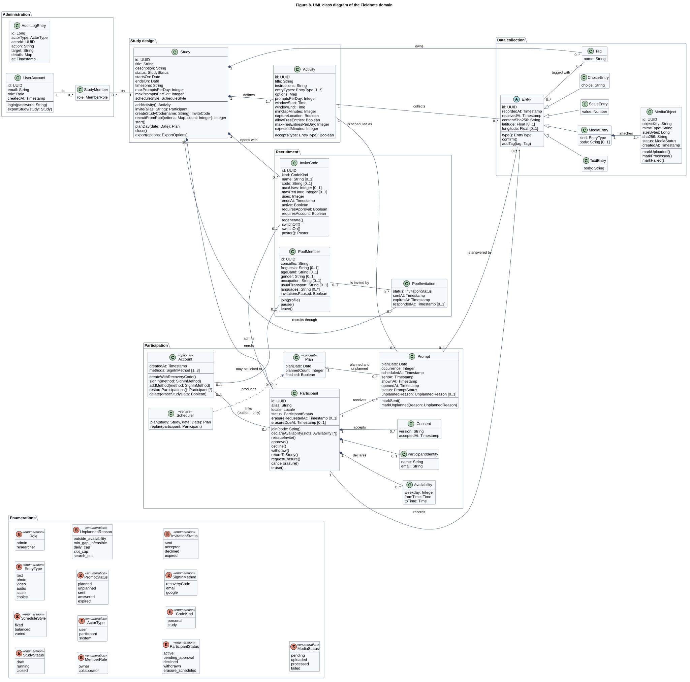
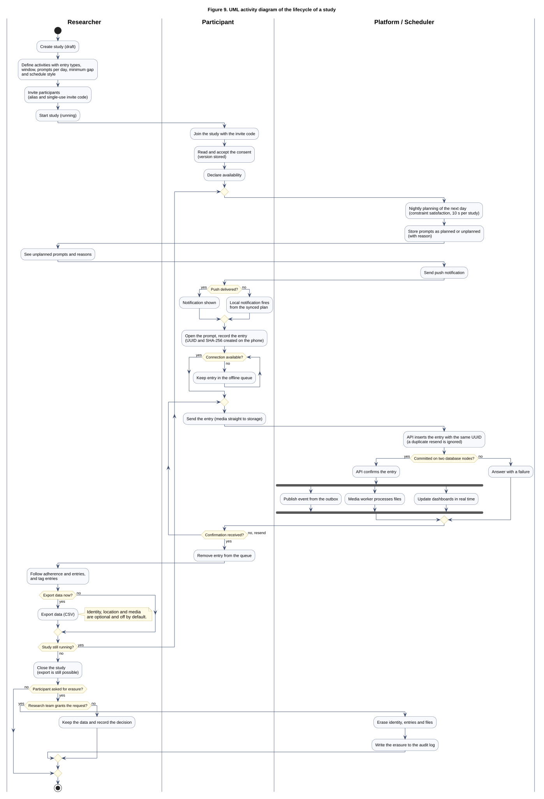

# Domain model

Status: proposed, 1 October 2026. Nothing described here is implemented. The classes are a
conceptual view of the domain; the tables are in the [data model](data-model.md) and will change
during implementation.

*Figure 8. UML class diagram of the Fieldnote domain, grouped in four packages. Filled diamonds are compositions, the open diamond is an aggregation, and the enumerations are listed in their own package.*

## Main classes

The classes are grouped by the concern they serve.

**Study design.** A `Study` has a title, a description, start and end dates, a time zone, prompt limits (`maxPromptsPerDay`, `maxPromptsPerSlot`),
a schedule style (`fixed`, `balanced` or `varied`) and a status (`draft`, `running` or `closed`).
It is composed of one or more `Activity` objects, because an activity has no meaning outside its
study. An activity says what participants are asked to record: the entry types it accepts (one or
more), the window, the number of prompts per day, the minimum gap, the expected effort in minutes,
whether location is requested and whether free entries are allowed. The study operations a
researcher triggers are `addActivity()`, `invite()`, `start()`, `close()` and `export()`. `planDay()` is
run every night by the scheduler, not by the researcher, and asks the `Scheduler` for a `Plan`; it plans
prompts only for running studies.

**Administration.** `UserAccount` is an administrator or a researcher (`Role`). A researcher reaches
a study through `StudyMember`, which carries the member role (`owner` or `collaborator`).
Participants are not user accounts. `AuditLogEntry` records who did what; its actor is a user, a
participant or the system (`ActorType`).

**Participation.** A `Participant` belongs to exactly one study and is known by an alias and a
locale. Three classes depend on the participant and are composed in it: `Consent` (the version
accepted and when), `Availability` (the hours when prompts are accepted) and the optional
`ParticipantIdentity` (name and email, zero or one). `Participant.erase()` removes the identity and
the entries of that participant. A `Prompt` is one request of one activity to one participant on a
given day. It carries a `PromptStatus` and, when it was not planned, one `UnplannedReason`. A prompt not
answered by the end of its activity window becomes `expired`; a late entry from the offline queue is
still accepted and keeps its link to the prompt. The
`Scheduler` is a service, not stored data: it produces a `Plan`, the set of planned and unplanned
prompts of one study for one day, together with whether the search finished or was cut by the time
limit.

**Data collection.** `Entry` is what the participant recorded, tied to its participant and
activity, and to a prompt when it answers one. `MediaObject` is a file in object storage with a
`MediaStatus`. A `Tag` belongs to a study and labels entries; the association between entries and
tags is many to many.

## Why Entry is modelled as it is

An activity can accept several entry types, so the participant chooses the type when answering.
What changes between types is the content, not the lifecycle: every entry has the same identifier,
the same two clocks (`recordedAt` from the phone, `receivedAt` from the server), the same hash and
the same optional location, and every entry is confirmed the same way. For that reason `Entry` is
abstract and holds what is common, and four specialisations hold the content: `TextEntry` (a
body), `ScaleEntry` (a value), `ChoiceEntry` (the option chosen) and `MediaEntry`. A `MediaEntry`
covers photo, video and audio with a `kind` attribute instead of three subclasses, because they
differ only in the file and its processing, and the files are `MediaObject` instances. The
`EntryType` enumeration is the shared vocabulary: `Activity.entryTypes` lists the allowed values and
`Entry.type()` returns the one that applies. An alternative is a single class with an `EntryType`
attribute and nullable fields; the hierarchy was preferred for the diagram because it shows which
data belongs to which kind of answer, at the cost of a mapping to one table (see below).

`Entry.confirm()` is the point where the API checks the content, checks that the media objects
exist and commits on two database nodes. Only after that does the app consider the entry sent. The
entry identifier is created on the phone, so a resend after a failure refers to the same object.

## Mapping to the data model

| Domain class | Table in the data model | Note |
|---|---|---|
| `Study`, `Activity` | `study`, `activity` | `Activity.entryTypes` is the column `entry_types`. `options` is `jsonb` and holds the options of a choice activity and the range and labels of a scale activity |
| `UserAccount`, `StudyMember` | `user_account`, `study_member` | Refresh tokens (`refresh_token`) are authentication detail and are not in the domain |
| `Participant`, `ParticipantIdentity`, `Consent`, `Availability` | `participant`, `participant_identity`, `consent`, `availability` | Invite code hash, device token hash and push token are columns of `participant` and are left out of the class |
| `Prompt` | `prompt` | `status` and `unplanned_reason` are text columns, shown as enumerations |
| `Entry` and its subclasses | `entry` | One table. `entry_type` holds the type, `body` the text, `value` the scale value and `choice` the option chosen |
| `MediaObject`, `Tag` | `media_object`, `tag`, `entry_tag` | `entry_tag` is the join table of the many-to-many association |
| `AuditLogEntry` | `audit_log` | Logical references only, no foreign keys |
| `Plan`, `Scheduler` | `plan_run` | `Plan` is a result stored as prompts; `plan_run` records for each run whether it finished or was cut, the nodes expanded, the prompts planned and unplanned and the solve time. The `Scheduler` is a service and has no table |

The class model is conceptual and the data model is physical, so they differ on purpose.

- Infrastructure is not domain. `outbox_event` (the transactional outbox), `leader_lease` (which
  scheduler replica is active) and `refresh_token` exist to make the system fault tolerant and
  secure; a researcher would not name them when describing a study. They stay in the data model only.
- Associations become keys and join tables. For example `Participant` and `Entry` are linked by
  `entry.participant_id`, and `Entry` and `Tag` by `entry_tag`.
- Inheritance is flattened. The four entry classes map to one `entry` table, because they share
  most columns and queries filter entries across types.

The data model carries what the class model needs: `entry.entry_type` and `entry.choice` hold the type and the
option chosen in a `ChoiceEntry`, and `plan_run` records whether a run was cut.

## Reading the lifecycle diagram

*Figure 9. UML activity diagram of the lifecycle of a study, in three swimlanes: researcher, participant and platform with its scheduler.*

The researcher creates a study, which starts as `draft`, and defines its activities with their
schedule rules. The researcher then invites participants, each with an alias and a single-use
invite code, and starts the study. A participant joins by typing the code, accepts the consent
text (the version is stored) and declares the hours when prompts are acceptable.

From then on one loop runs for each day of the study. At night the scheduler plans the next day as
a constraint satisfaction problem, with a limit of 10 s per study, and stores each prompt as planned
or unplanned with its reason. The researcher sees the unplanned prompts and why they were left out.
The scheduler sends a push notification at the planned time. The notification is best effort, so a
decision follows: if the push does not arrive, the local notification scheduled from the synced plan
fires instead, and each prompt is shown once.

The participant opens the prompt and records the entry. The phone creates the UUID and the content
hash. A second decision handles connectivity: without a connection the entry waits in the offline
queue until one is available. The app then sends the entry, with media going straight to object
storage. The API inserts the entry with the same UUID, so a duplicate resend is ignored, and asks
whether the commit reached two database nodes. If it did, the API confirms the entry and three
things happen in parallel: the event is published from the outbox, the media worker processes the
files, and the dashboards are updated in real time. This is a real fork, since none of them depends
on the others. If the commit failed, the API answers with a failure and the app resends the same
UUID, which is safe because the insert is idempotent. The app removes the entry from its queue only
after the confirmation.

The researcher follows adherence and tags entries while the study runs, and closes the study when it
ends. The export as CSV can happen at any time, during the study or after it; identity, location and media are optional and off by default. The last branch is the erasure request. When a participant asks for
erasure, the research team decides whether to grant it, because the GDPR exception for research may
apply (see [security](security.md)). If granted, the platform erases the identity, the entries and
the files, and writes the erasure to the audit log. The request can in practice arrive at any time;
the diagram places it at the end to keep the main flow readable.

## Related documents

- [Data model](data-model.md)
- [Scheduler](scheduler.md)
- [Architecture](architecture.md)
- [Security](security.md)
